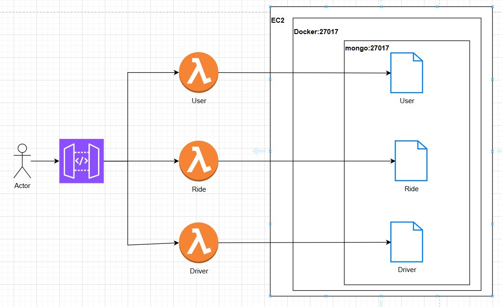

# AYGO-Uber 

## Introducción

Diseño de un prototipo y una arquitectura microservicios para la aplicación de Uber usando las herramientas que ofrece AWS como apigateway, lambda o EC2.

## Arquitectura Prototipo

### Video de funcionalidad

### Base de datos (EC2 - MongoDb)

Se esta usando una Ec2 que contiene un docker que esta eecutando la base de datos mongoDb, y se esta usando un volumen en el Docker para su persistencia.

### Servicios (Lambda)

Para el prototipo se estan usando 3 servicios User, Driver y Ride. Cada servicio esta montado en una lambda.

#### User
User es el que hace las peticiones de viaje, en cual hace que se pida los conductores disponibles y el valor de cada uno de ellos dependiendo de las características del vehículo que ofrezcan, además en sus atributos debe tener el telefono para facilitar la comunicación con el conductor y su localización para calcular el precio desde el punto que se encuentra hasta el punto destino.
##### Modelo

##### Endpoints

* **Creación de Usuario (POST /user):** Creación de usuario
  **Obtener todos los usuarios (GET /users):** Obtención de todos los usuarios
* **Obtener opciones para el viaje (GET /user/{userId}/destination):** Obtener las diferentes opciones como costo, tipo de carro, conductores mas cercanos a esa persona para poder elegir uno entre ellos:
* **Petición de viaje (POST /user/{userId}/askTravel):** Pedir el viaje con un conductor y abrir comunicación con él

#### Driver
Driver es el que acepta las solicitudes de viaje a los usuarios y presta el servicio correspondiente, en los atributos se muestra su disponibilidad, las caracteristicas de su vehículo y su localización para poder obtener el valor del costo que sería viajar con él
##### Modelo

##### Endpoints

* **Creación de conductor (POST /driver):** Creación de driver
* **Obtener todos los conductores (GET /drivers):** Obtención de todos los conductores
* **Obteter conductor (GET /driver/{driverId}):** Obtener conductor por Id
* **Obtener conductores cercanos (GET /drivers/point/{startingx}/{startingy})**: Obtener conductores cercanos a un punto, normalmente es para los conductores cercanos a un usuario
* **Actualizar disponibilidad(PUT /driver/{driverId}/udpate/status):** Actualizar disponibilidad del conductor
* **Actualizar localización (PUT /driver/{driverId}/udpate/location):** Actualizar la localización del conductor cuando vuelva a estar disponible

#### Ride
Ride es el viaje y contiene lo que es el id del usuario y el conductor para conocer quienes son los participantes del viaje, localización inicial, localización final y localización actual, también conocer el precio y el estado del viaje, como (WaitingResponseDriver,UserWaitingDriverTraveling,Traveling, finish).
##### Modelo

##### Endpoints

* **Creación de viaje (POST /ride):** Creación de viaje
  **Obtener todos los viajes (GET /rides):** Obtención de todos los viajes
* **Obtener el viaje según Id (GET /ride/{rideId}):** Obtener los de detalles de un viaje en especifico
* **Opciones de viaje (GET /rides/options?startingx&startingy&endingx&endingy"):** Para obtener los diferentes detalles y precios de un viaje desde los puntos dados.
* **Finalización de un viaje(PUT /ride/{rideId}/finish):** Actualización del estado del viaje, cambiar el estado del conductor a disponible y pedir la actualización de la localización del conductor

## Autores
   * Yarit Yajanny Villalobos
